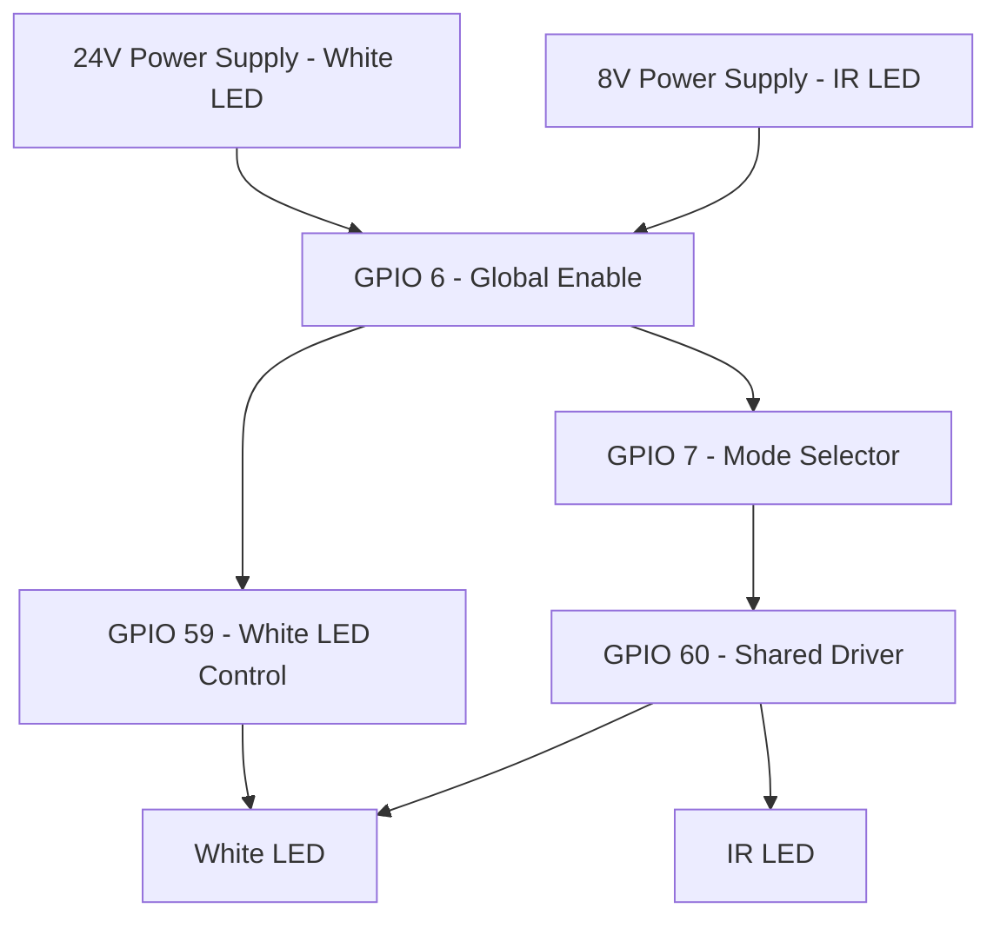

Eufy E210 Outdoor Cam  
FCCID: `2AOKB-T8441`

## Device Specifications

### Hardware
| Component      | Details          |
|----------------|------------------|
| **SoC**        | Ingenic T31X     |
| **Sensor**     | SC3336           |
| **Flash**      | 32MB             |
| **WiFi**       | bcm43438a1       |
| **Ethernet**   | None             |
| **Power**      | USB              |
| **Data**       | USB              |

### LEDs
| Type           | Details          |
|----------------|------------------|
| **Status LED** | Blue / Red       |
| **White LEDs** | 2x White LEDs    |
| **IR LEDs**    | 850nm x4         |

---

Unusual hardware design for LED control:

Observations:

---

| Mode           | GPIO 6   | GPIO 7   | GPIO 59  | GPIO 60  |
|----------------|----------|----------|----------|----------|
| White LED ON   | Set (1)  | Clear (0)| Set (1)  | Set (1)  |
| White LED OFF  | Clear (0)| Clear (0)| Clear (0)| Clear (0)|
| IR LED ON      | Set (1)  | Set (1)  | Clear (0)| Set (1)  |
| IR LED OFF     | Clear (0)| Clear (0)| Clear (0)| Clear (0)|
| Both LEDs ON   | Set (1)  | Set (1)  | Set (1)  | Set (1)  |
| Both LEDs OFF  | Set (1)  | Set (1)  | Clear (0)| Clear (0)|
