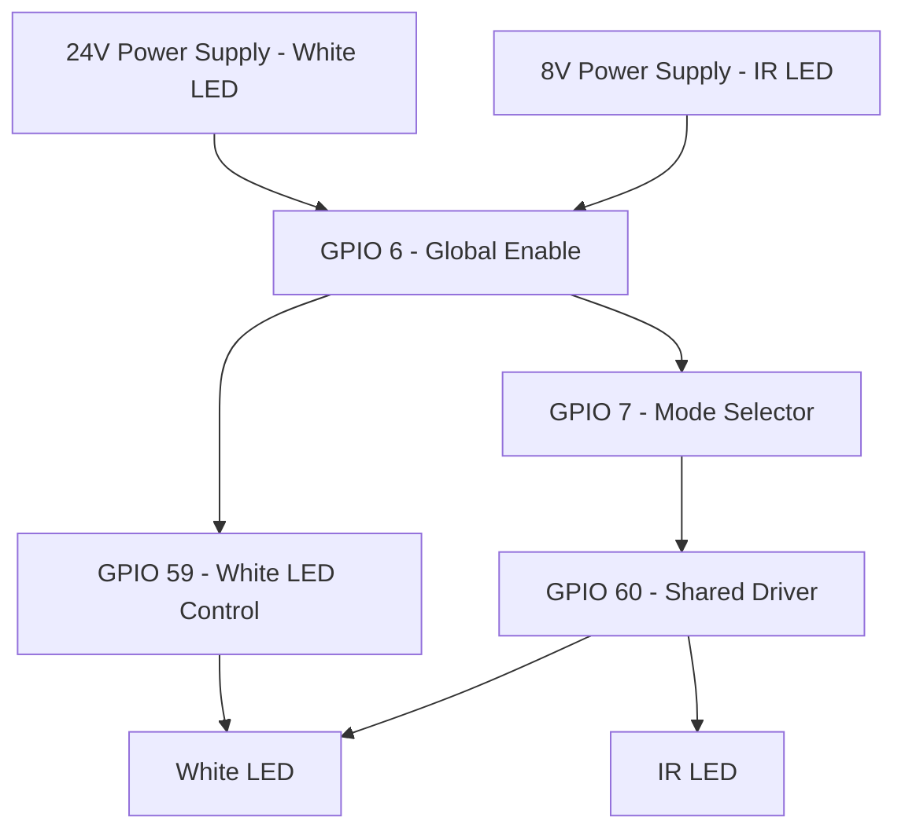

Unusual hardware design for LED control:

Observations:

---

| Mode           | GPIO 6   | GPIO 7   | GPIO 59  | GPIO 60  |
|----------------|----------|----------|----------|----------|
| White LED ON   | Set (1)  | Clear (0)| Set (1)  | Set (1)  |
| White LED OFF  | Clear (0)| Clear (0)| Clear (0)| Clear (0)|
| IR LED ON      | Set (1)  | Set (1)  | Clear (0)| Set (1)  |
| IR LED OFF     | Clear (0)| Clear (0)| Clear (0)| Clear (0)|
| Both LEDs ON   | Set (1)  | Set (1)  | Set (1)  | Set (1)  |
| Both LEDs OFF  | Set (1)  | Set (1)  | Clear (0)| Clear (0)|
